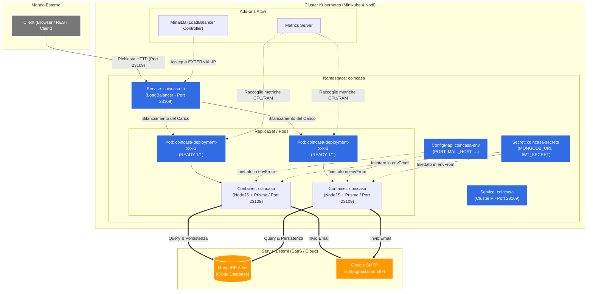

# Schema dell'Architettura Kubernetes - CoinCasa

```mermaid
graph TB
    subgraph Clienti ["Mondo Esterno"]
        Utente["Client (Browser / REST Client)"]
    end

    subgraph Minikube ["Cluster Kubernetes (Minikube 4 Nodi)"]
        subgraph Addons ["Add-ons Attivi"]
            MS["Metrics Server"]
            MLB["MetalLB (LoadBalancer Controller)"]
        end

        subgraph Namespace ["Namespace: coincasa"]
            ServiceLB["Service: coincasa-lb<br>(LoadBalancer - Port 23109)"]
            ServiceCluster["Service: coincasa<br>(ClusterIP - Port 23109)"]

            subgraph Pods ["ReplicaSet / Pods"]
                Pod1["Pod: coincasa-deployment-xxx-1<br>(READY 1/1)"]
                Pod2["Pod: coincasa-deployment-xxx-2<br>(READY 1/1)"]
                
                App1["Container: coincasa<br>(NodeJS + Prisma / Port 23109)"]
                App2["Container: coincasa<br>(NodeJS + Prisma / Port 23109)"]

                Pod1 --> App1
                Pod2 --> App2
            end

            ConfigMap["ConfigMap: coincasa-env<br>(PORT, MAIL_HOST, ...)"]
            Secret["Secret: coincasa-secrets<br>(MONGODB_URI, JWT_SECRET)"]
        end
    end

    subgraph Cloud ["Servizi Esterni (SaaS / Cloud)"]
        MongoDB[("MongoDB Atlas<br>(Cloud Database)")]
        Gmail["Google SMTP<br>(smtp.gmail.com:587)"]
    end

    Utente -->|"Richiesta HTTP (Port 23109)"| ServiceLB
    ServiceLB -->|Bilanciamento del Carico| Pod1
    ServiceLB -->|Bilanciamento del Carico| Pod2

    ConfigMap -.->|Iniettato in envFrom| App1
    ConfigMap -.->|Iniettato in envFrom| App2
    Secret -.->|Iniettato in envFrom| App1
    Secret -.->|Iniettato in envFrom| App2

    App1 & App2 ==>|Query & Persistenza| MongoDB
    App1 & App2 ==>|Invio Email| Gmail

    MS -.->|Raccoglie metriche CPU/RAM| Pod1 & Pod2
    MLB -.->|Assegna EXTERNAL-IP| ServiceLB

    classDef k8s fill:#326ce5,stroke:#fff,stroke-width:2px,color:#fff;
    classDef cloud fill:#ff9900,stroke:#fff,stroke-width:2px,color:#fff;
    classDef external fill:#777,stroke:#fff,stroke-width:2px,color:#fff;
    class ServiceLB,ServiceCluster,Pod1,Pod2,ConfigMap,Secret k8s;
    class MongoDB,Gmail cloud;
    class Utente external;
```
